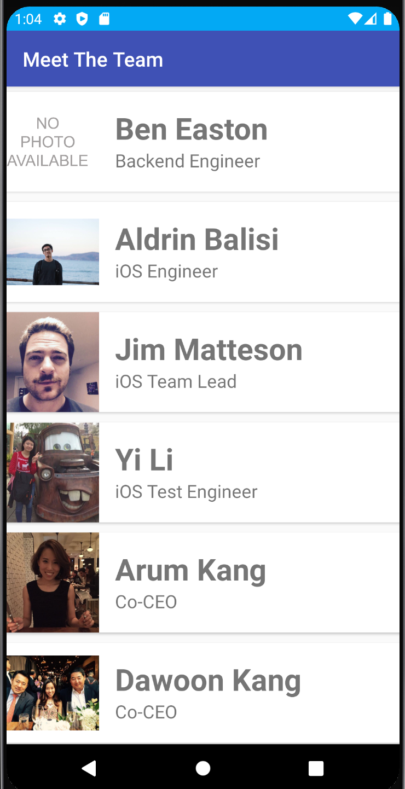
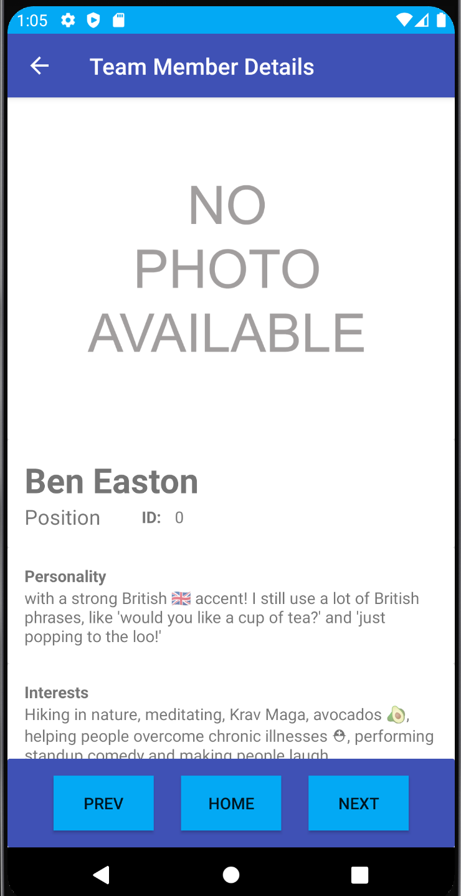

# Meet The Team
## Project Overview:
**Meet The Team** is an android app developed as a code challenge with the goal of taking a json file and displaying the contained data in a user profile format.

## User Stories
- As a User I want to be able to get a list of team members with their names, positions, and a small photo with the ability to view more details.
  - Consideration: RecyclerView to list all team members with basic details. On tap display details in a second activity.

- As a User I want to have a clean and easy to use UI.
  - Consideration: Basic UI in details page with a scrollable section for the details and three buttons for next, home, and previous at the bottom. This will allow returning to the main activity from both the top and bottom of the app from this activity.

- As a User I want to be able to switch between details of team members without the need to go back to the main activity.
  - Consideration: Utilize next and previous (prev) buttons to navigate the collection of team members based on the position of the displayed information.

## How To Use The App
1. ### Installation
Install the .APK onto an Android device and open the app from the apps screen or home screen.

1. ### Main Activity

  

The Main Activity will be displayed, this contains a list of all team members in the contained data. To view more details simply tap on the team member whos details are to be viewed.

1. ### Team Member Details Activity

  

On the details screen the details for the specific chosen team member will be displayed, should they exceed the size of the devices screen the ability to scroll down is available. From this screen you can return to the Main Activity from the top or bottom home button. The next and previous buttons will send you to the appropriate team member who is after or before the current team member. Should the next button be be used at the end of the list (or previous at the beginning) they will send you to the user who is appropriately positioned at the beginning (or end) of the list.

## Tools and Libraries
* [GSON](https://sites.google.com/site/gson/gson-user-guide)(Used to parse Json data)
* [GLIDE](https://github.com/bumptech/glide/blob/master/README.md)(Used to display images easily and efficiently from string URLs)

## Versions
Android SDK: Android 11, API level 30 (Chosen for 99% or higher device compatibility)

## Creator
[Daniel Logerstedt](https://github.com/daniellogerstedt)